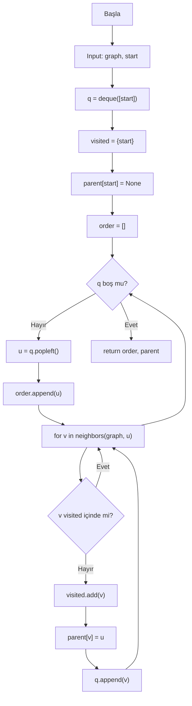
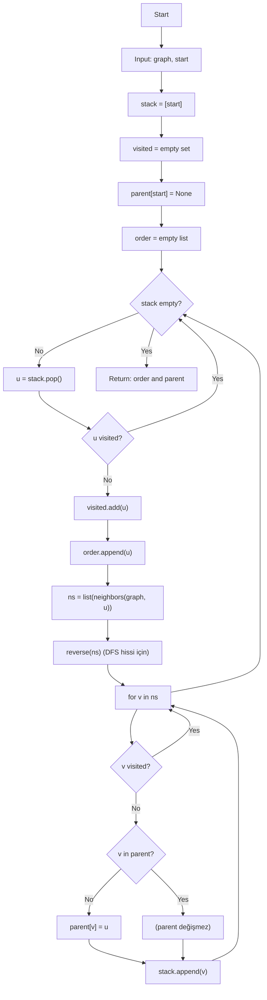
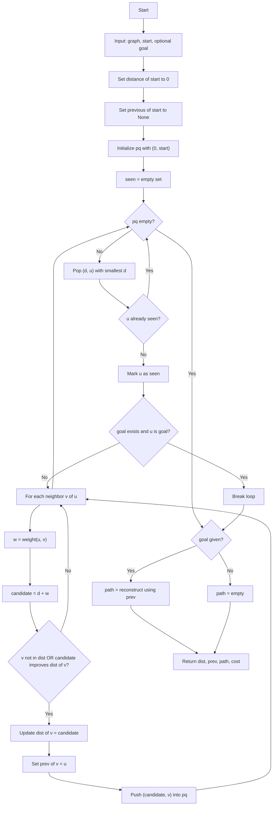
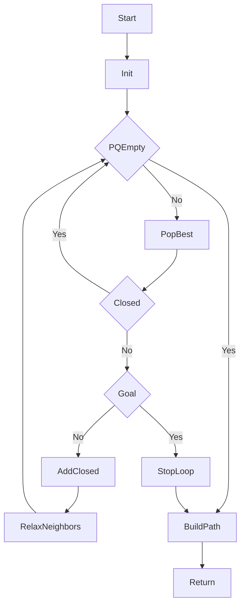
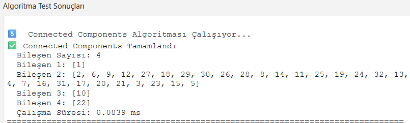
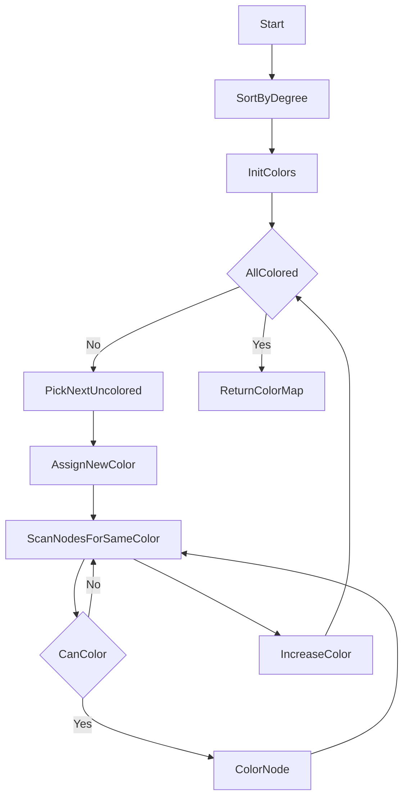
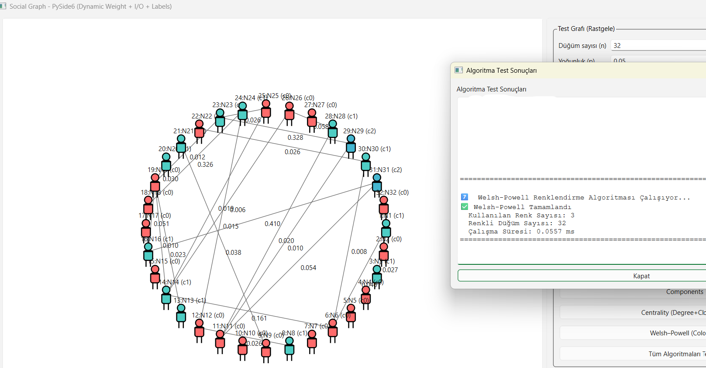
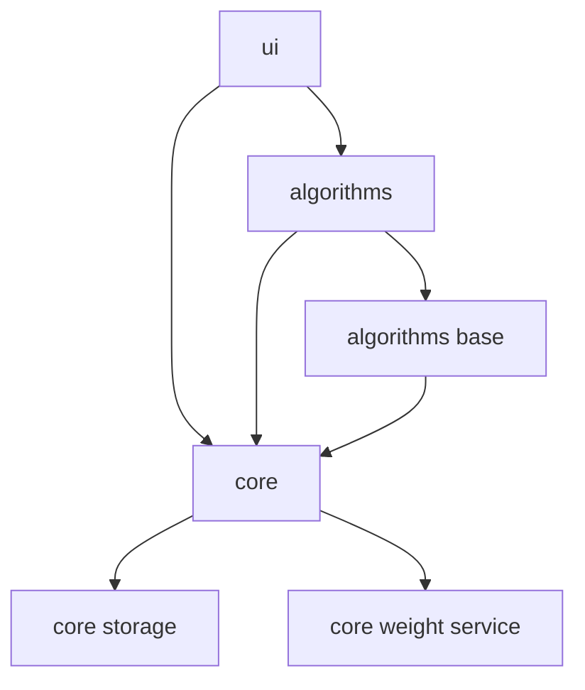
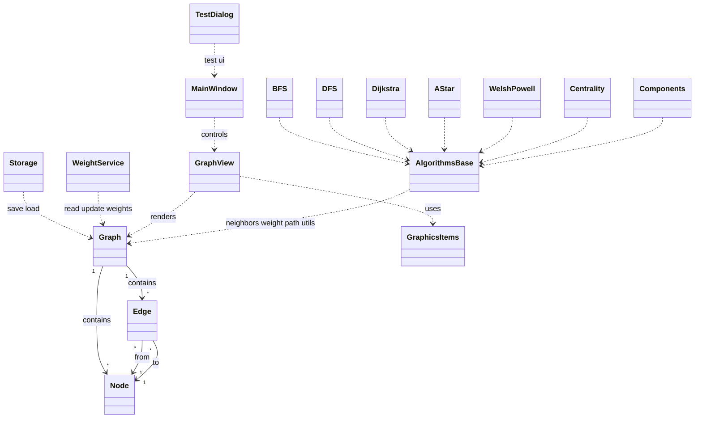
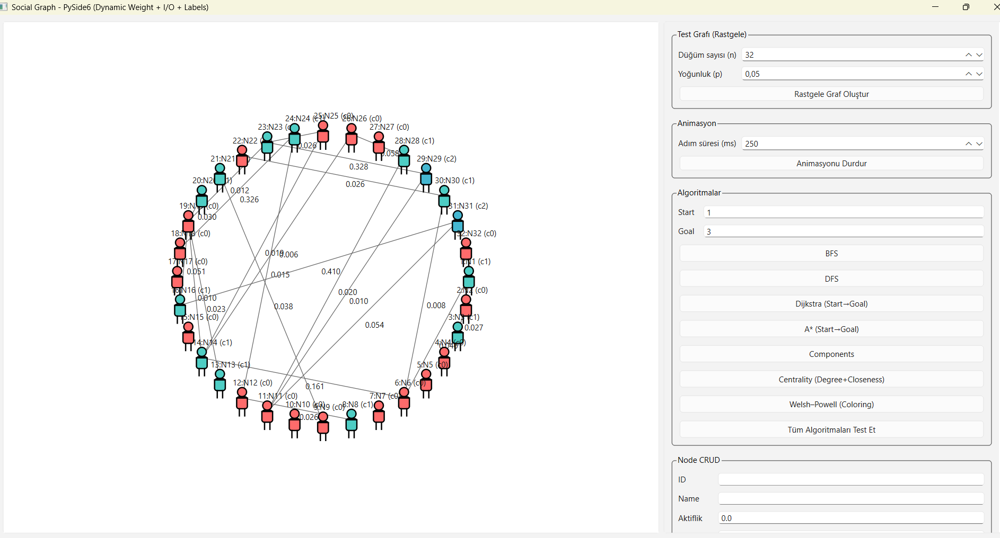

# Sosyal Ağ Analizi Uygulaması  
**Ekip:** Melisa Ceylan  
**Tarih:** 02.01.2026  

---

## 1. Giriş

### 1.1 Problemin Tanımı
Sosyal ağlar; kullanıcılar (düğümler) ve aralarındaki ilişkiler (kenarlar) üzerinden modellenebilen, analiz edilmesi gereken karmaşık yapılardır. Gerçek hayatta “kim kiminle etkileşimde?”, “bir kullanıcıdan diğerine en kısa yol nedir?”, “ağ hangi alt topluluklara ayrılıyor?” gibi sorulara cevap aramak için graf teorisi temelli algoritmalar kullanılır.  
Bu proje, sosyal ağ benzeri verileri **graf modeli** ile temsil edip, temel graf algoritmalarını çalıştırarak sonuçları **görsel ve anlaşılır** biçimde sunan bir masaüstü uygulaması geliştirmeyi hedefler.

### 1.2 Amaç
Bu çalışmanın amacı:
- Sosyal ağ yapısını **düğüm–kenar (Graph)** modeliyle kurmak,
- BFS, DFS, Dijkstra, A* gibi algoritmalarla ağ üzerinde gezinme / yol bulma işlemlerini gerçekleştirmek,
- Welsh–Powell renklendirme ile düğüm renklendirme yaklaşımını uygulamak,
- Algoritmaların çalışmasını **görselleştirerek** adım adım izlenebilir hale getirmek,
- Graf verisini **JSON/CSV** formatlarında kaydedip tekrar yükleyebilmek,
- Hatalı veri girişlerini (duplicate edge, self-loop vb.) yöneterek sistemin güvenilirliğini artırmaktır.

### 1.3 Kapsam
Uygulama aşağıdaki ana bileşenleri kapsar:
- **Graf Modeli İşlemleri:** Düğüm/kenar ekleme, silme, güncelleme, ağırlık (weight) yönetimi  
- **Algoritmalar:** BFS, DFS, Dijkstra, A*  
- **Renklendirme:** Welsh–Powell düğüm renklendirme  
- **Görselleştirme:** Algoritma adımlarının ekranda animasyon/renk değişimiyle gösterimi  
- **Veri Saklama:** JSON/CSV dışa aktarma ve içe aktarma  
- **Test ve Hata Yönetimi:** Hatalı kenarlar, tekrar eden bağlantılar, self-loop vb. kontroller

### 1.4 Varsayımlar ve Kısıtlar
- Dijkstra algoritması gereği **negatif ağırlıklı (negative weight)** kenarlar desteklenmez; bu tür girişler hata olarak ele alınır.
- Self-loop (bir düğümün kendisine bağlanması) ve duplicate edge (aynı iki düğüm arasında aynı bağlantının tekrar eklenmesi) gibi durumlar uygulama kurallarına göre engellenir veya kullanıcıya uyarı verilir.
- Uygulama bir “sosyal ağ simülasyonu” değil; sosyal ağların **graf temsili ve analizini** hedefleyen bir analiz aracıdır.

### 1.5 Beklenen Çıktılar
- Seçilen algoritmaya göre ziyaret sırası / bulunan yol / maliyet bilgisi
- Görsel ekranda algoritmanın adım adım ilerleyişi
- Kaydedilebilir/yüklenebilir graf veri dosyaları (JSON/CSV)

  ---

## 2. Algoritmalar ve Analizler

Bu bölümde uygulamada gerçeklenen algoritmaların çalışma mantığı, akış diyagramları (Mermaid), karmaşıklık analizi ve kısa literatür notları sunulmuştur.

### 2.1 BFS (Breadth-First Search) — Genişlik Öncelikli Arama
 
BFS, bir graf üzerinde başlangıç düğümünden başlayıp düğümleri katman katman (level-by-level) ziyaret eden temel bir gezme algoritmasıdır. Önce başlangıcın komşuları, sonra onların komşuları şeklinde genişleyerek ilerler. Bu yüzden kuyruk (queue) veri yapısı ile uygulanması doğaldır. Ağırlıksız graflarda BFS, başlangıçtan diğer düğümlere giden en az kenarlı yolu (shortest path in number of edges) bulur.

#### 2.1.1 Literatür Notu

- BFS, graf gezme algoritmalarının en temel taşlarından biridir ve özellikle ağırlıksız en kısa yol problemi için standart yaklaşımdır.
- Erken dönem çalışmalarda BFS’nin temel fikri (katmanlı genişleme) ve ağ/maze benzeri yapılarda kullanımı klasikleşmiştir; günümüzde sosyal ağ analizinden ağ güvenliğine kadar birçok alanda “temel yapı taşı” olarak geçer.
- BFS’nin bir başka güçlü yönü, gezerken aynı anda ebeveyn (parent) ilişkisi tutularak “hangi düğüme nereden ulaşıldığı” bilgisinin çıkarılabilmesidir.

#### 2.1.2 Akış diyagramı:

#### 2.1.3 Çalışma Mantığı

Bu süreç BFS’yi şu şekilde yürütür:

**Başlatma (Initialization)**

- q = deque([start]) ile kuyruk yalnızca başlangıç düğümünü içerir.
- visited = {start} ile başlangıç düğümü daha en başta ziyaret edildi işaretlenir.
- parent = {start: None} ile başlangıcın ebeveyni olmadığını belirtilir.
- order = liste, düğümlerin işlenme (kuyruktan çıkma) sırasını tutar.

**Ana döngü (while q)**

Kuyruk boş değilken çalışır.

- u = q.popleft() ile kuyruğun başından düğüm alınır (FIFO mantığı).
- order.append(u) ile işlenen düğüm ziyaret sırasına eklenir.
- Bu kodda “order”a ekleme, düğüm kuyruğa girince değil, kuyruktan çıkınca yapılır.

**Komşuları gezme (for v in neighbors(graph, u))**

- for v in neighbors(graph, u) ile u düğümünün komşuları dolaşılır.
- Eğer v daha önce ziyaret edilmediyse:

    - visited.add(v) → düğüm keşfedildiği an visited işaretlenir (tekrar kuyruğa eklenmesi engellenir).
    - parent[v] = u → v düğümüne ilk kez u üzerinden ulaşıldığı kaydedilir (BFS ağacı oluşur).
    - q.append(v) → v kuyruğun sonuna eklenir; böylece katman mantığı korunur.

**Çıktı**

Döngü bittiğinde kuyruk boşalmıştır, yani erişilebilen tüm düğümler gezilmiştir.

Fonksiyon şunu döndürür:

- order: Düğümlerin BFS sırasında kuyruktan çıkma sırası (popleft sırası)
- parent: her düğümün BFS ağacındaki ebeveyni (yol geri sarma için kullanılabilir)

Bu sürüm, parent sayesinde istenirse “start → herhangi bir düğüm” yolunu geriye doğru takip ederek çıkarabilir (parent chain).

#### 2.1.4 Karmaşıklık Analizi

Bu uygulamada BFS, visited kümesi ile her düğümü en fazla bir kez keşfeder ve her kenarı en fazla bir kez (yönsüz graf ise pratikte iki uçtan) kontrol eder.

- **Zaman Karmaşıklığı:** **O(V + E)**
  - V: düğüm sayısı, E: kenar sayısı
  - Her düğüm kuyruğa en fazla 1 kez girer/çıkar.
  - neighbors(graph, u) üzerinden komşular gezilirken toplamda kenarlar taranır.

- **Bellek Karmaşıklığı:** **O(V)**
  - visited en fazla V düğüm tutar.
  - parent en fazla V kayıt tutar.
  - order en fazla V eleman tutar.
  - q (deque) en kötü durumda O(V) büyüyebilir.

### 2.2 DFS (Depth-First Search) — Derinlik Öncelikli Arama
DFS (Depth-First Search), bir graf üzerinde başlangıç düğümünden başlayarak **mümkün olduğunca derine** inmeyi hedefleyen temel bir gezme algoritmasıdır. Bir yol boyunca ilerler, ilerleyemeyince geri dönüp (backtracking) başka kollara yönelir. Bu davranış genellikle **yığın (stack)** ya da özyineleme (recursion) ile sağlanır.

#### 2.2.1 Literatür Notu

DFS, graf teorisinde en temel iki gezme yaklaşımından biridir (BFS ile birlikte). Literatürde DFS’nin önemi şu noktalarda vurgulanır:

- **Keşif mantığı:** DFS, bir düğümden başlayıp bir komşu üzerinden “olabildiğince derine” inmeye çalışır. Bu davranış, grafik üzerinde bir **arama ağacı (DFS tree)** oluşturur. Bu ağaç üzerinden “hangi düğüme nereden ulaşıldı?” bilgisi çıkarılabilir.
- **Temel alt yapı algoritması:** DFS, tek başına bir “gezinme” algoritması olmasının yanında;  
  **bağlı bileşen bulma**, **döngü (cycle) tespiti**, **topolojik sıralama**, **köprü ve kesme noktaları** gibi birçok graf probleminin temel bileşenidir. Bu yüzden ders kitaplarında ve klasik graf algoritmaları kaynaklarında “çok amaçlı temel araç” olarak geçer.
- **Uygulama alanı:** Sosyal ağlarda “ağın bir bölgesini derinlemesine tarama”, yazılım analizinde “bağımlılık grafında derin arama”, ağ güvenliğinde “erişilebilirlik taraması” gibi örneklerde DFS yaklaşımı sık görülür.
- **Yığın (stack) / özyineleme:** Literatürde DFS genellikle recursion ile anlatılsa da, pratikte recursion limitleri nedeniyle **stack tabanlı iteratif DFS** de standarttır. .
- Kısacası DFS, “grafı dolaşmak için basit bir yöntem” olmanın ötesinde, birçok daha büyük algoritmanın iskeletini oluşturan temel bir parçadır.

#### 2.2.2 Akış Diyagramı

#### 2.2.3 Çalışma Mantığı

Bu projedeki DFS uygulaması, özyineleme yerine **yığın (stack) tabanlı iteratif** yöntemle gerçekleştirilmiştir. Algoritma, bir düğümden başlayarak mümkün olduğunca derine ilerler; ilerleyemediğinde yığından geri dönerek başka dalları keşfeder.

**Başlatma**
- stack = [start]: ile arama başlangıç düğümünü içeren bir yığınla başlatılır.
- visited = set(): başlangıçta boştur; düğümler “işlenecekleri anda” visited olarak işaretlenir.
- parent[start] = None ile başlangıç düğümünün ebeveyni olmadığı belirtilir.
- order = []` listesi, düğümlerin DFS sırasında **işlenme sırasını** tutmak için kullanılır.

**Ana Döngü**

Yığın boşalana kadar şu adımlar tekrarlanır:
- u = stack.pop() ile yığının en üstündeki düğüm alınır (LIFO).
- Eğer `u` daha önce ziyaret edilmişse (`u in visited`), bu düğüm işlenmeden atlanır (`continue`).  
  Bu kontrol, aynı düğümün farklı yollardan yığına eklenmiş olabileceği durumlarda **tekrar işlemeyi engeller**.
  - u ziyaret edilmemişse:
  - visited.add(u) ile düğüm ziyaret edildi olarak işaretlenir.
  - order.append(u) ile işlenme sırasına eklenir.

**Komşuların Yığına Eklenmesi (DFS Sırasını Korumak İçin)**
- neighbors(graph, u) ile u düğümünün komşuları alınır, list() ile listeye çevrilir ve reverse() yapılır.
- Bunun amacı şudur: Yığın LIFO çalıştığı için komşuları ters sırayla yığına eklemek, ekranda/çıktıda **daha doğal bir DFS ziyaret sırası** üretir.
- Her komşu v için:
  - Eğer v henüz ziyaret edilmemişse:
    - v ilk kez görülüyorsa parent[v] = u atanır. Böylece DFS ağacı oluşur ve “v düğümüne hangi düğüm üzerinden ulaşıldı?” bilgisi korunur.
    - stack.append(v) ile v işlenmek üzere yığına eklenir.

**Çıktı**

Algoritma sonunda aşağıdaki bilgiler döndürülür:
- order: Düğümlerin DFS sırasında **işlendiği** (visited’a alındığı) sıra
- parent: DFS ağacındaki ebeveyn ilişkileri (istenirse herhangi bir düğüme giden yol, ebeveynler üzerinden geriye doğru takip edilerek çıkarılabilir)

#### 2.2.4 Karmaşıklık Analizi

DFS algoritmasının çalışma maliyeti grafın büyüklüğüne bağlıdır. Burada  
**V** düğüm sayısını, **E** ise kenar sayısını ifade eder.

**Zaman Karmaşıklığı: O(V + E)**  
Bu implementasyonda zaman karmaşıklığının O(V + E) olmasının temel gerekçeleri şunlardır:

- **Düğümler açısından (O(V))**:  
  Her düğüm, visited kümesine alındıktan sonra bir daha işlenmez. Kodda yer alan  
  if u in visited: continue kontrolü, aynı düğümün yığına birden fazla kez eklenmiş olması durumunda bile düğümün tekrar tekrar işlenmesini engeller. Bu nedenle her düğüm en fazla bir kez “işleme” adımına girer ve bu kısım toplamda O(V) maliyet oluşturur.

- **Kenarlar/komşuluk taraması açısından (O(E))**:  
  Her düğüm işlenirken komşuları for v in ns: döngüsüyle kontrol edilir. Tüm düğümler üzerinden bakıldığında komşuluk listelerinin toplam uzunluğu kenar sayısıyla orantılıdır. Bu nedenle komşu kontrolü adımı toplamda O(E) zaman alır. (Yönsüz graflarda her kenar iki düğümün komşuluk listesinde görülebilir; bu durum sabit katsayı farkı yaratır, ancak asimptotik ifade yine O(E) olarak kalır.)

- **Komşuları ters çevirme adımı (reverse) (O(E))**:  
  Kodda DFS ziyaret sırasını daha tutarlı hale getirmek için komşular listeye çevrilip ters çevrilmektedir (ns = list(...), ns.reverse()). Bu işlem, her düğüm için o düğümün derece değeri kadar çalışır. Tüm düğümler için derece toplamı kenar sayısıyla orantılı olduğundan, bu adım da toplamda O(E) mertebesindedir.

Sonuç olarak, düğüm işleme maliyeti O(V) ve komşuluk/kenar taraması maliyeti O(E) olduğundan toplam zaman karmaşıklığı **O(V + E)** olarak ifade edilir.

**Bellek Karmaşıklığı: O(V)**  
Algoritmanın ek bellek kullanımı düğüm sayısıyla orantılıdır:
- `visited` kümesi en fazla V düğüm tutar.
- `parent` sözlüğü her düğüm için en fazla bir ebeveyn bilgisi saklar (en fazla V kayıt).
- `order` listesi ziyaret edilen düğümleri tutar (en fazla V eleman).
- `stack` yığını, en kötü durumda V düğüme kadar büyüyebilir.

Bu nedenle DFS’nin ek bellek karmaşıklığı **O(V)**’dir.

### 2.3 Dijkstra - Ağırlıklı Graf İçin En KIsa Yol

Dijkstra algoritması, ağırlıklı bir graf üzerinde bir başlangıç düğümünden diğer düğümlere (veya belirli bir hedef düğüme) giden **en düşük toplam maliyetli (en kısa) yolları** bulmak için kullanılan klasik bir yöntemdir. Algoritma, her adımda geçici olarak en küçük mesafeye sahip düğümü seçerek bu düğümün mesafesini “kesinleştirir” ve komşu düğümler için daha iyi bir maliyet bulunup bulunmadığını kontrol eder (relaxation).

 Dijkstra, **negatif ağırlıklı** kenarlar bulunduğunda doğru sonuç garantisi vermez. Bu nedenle uygulamada negatif ağırlık kullanımına izin verilmemesi beklenir.

 #### 2.3.1 Lİteratür Notu

 Dijkstra algoritması, Edsger W. Dijkstra tarafından 1959 yılında ortaya konmuş ve negatif ağırlık içermeyen ağırlıklı graflarda en kısa yol probleminin klasik çözümü olarak literatürde yerini almıştır. Algoritmanın temel fikri; başlangıç düğümünden itibaren “en küçük geçici mesafeye sahip” düğümü seçip bu düğümün mesafesini kesinleştirerek ilerlemektir. Bu seçim stratejisi, kenar ağırlıkları negatif olmadığında doğruluğu garanti eder; çünkü negatif ağırlık bulunmadığında bir düğümün en kısa mesafesi kesinleştiğinde daha sonra daha kısa bir yol bulunması mümkün değildir.

Literatürde Dijkstra, hem kuramsal hem de uygulamalı açıdan geniş şekilde incelenmiştir:
- **Ağ yönlendirme (routing) ve iletişim ağları:** Dijkstra, düğümler arası en düşük maliyetli rotayı bulma problemiyle doğrudan ilişkilidir ve yönlendirme protokollerinin temelini açıklamak için sık referans verilir.
- **Harita/navigasyon ve yol planlama:** Yol ağları ağırlıklı graf olarak modellenebilir (mesafe, süre, maliyet ağırlık olabilir). Dijkstra, “en kısa yol” kavramının standart karşılaştırma (baseline) algoritmasıdır.
- **Sosyal ağ ve ilişki ağları:** Sosyal ağlarda bağlantılar ağırlıklandırıldığında (etkileşim sıklığı, güven skoru, maliyet vb.) iki kişi/grup arasındaki “en düşük maliyetli bağlantı zinciri” Dijkstra ile çıkarılabilir.
- **Algoritmik karşılaştırma açısından:** Dijkstra, A* gibi sezgisel yöntemlerin değerlendirilmesinde de referans noktasıdır; A*’ın sezgiseli etkisiz kaldığında davranışı Dijkstra’ya yaklaşır.

Sonuç olarak Dijkstra algoritması, negatif ağırlık içermeyen ağırlıklı graflarda en kısa yol problemini çözmede hem teorik olarak kanıtlanmış doğruluğa sahip hem de pratikte yaygın kullanılan temel bir yöntem olarak literatürde kabul görür.

#### 2.3.2 Akış Diyagramı

#### 2.3.3 Çalışma Mantığı

Bu implementasyon, Dijkstra algoritmasını min-heap tabanlı bir öncelik kuyruğu ile gerçekleştirir ve isteğe bağlı olarak hedef düğüm (goal) verildiğinde erken durdurma (early stop) yapar.

**Başlatma**

- dist sözlüğü yalnızca başlangıç için oluşturulur: dist[start] = 0.0. Diğer düğümlerin mesafesi başlangıçta “bilinmiyor/sonsuz” kabul edilir.
- prev[start] = None ile yol geri sarma için ebeveyn/öncül bilgisi tutulur.
- pq = [(0.0, start)] öncelik kuyruğu, (mesafe, düğüm) ikilileri tutar ve her zaman en küçük mesafeyi öne alır.
- seen kümesi, kesinleşmiş (artık daha kısa bulunmayacak şekilde işlenmiş) düğümleri takip eder.

**Ana Döngü: En küçük mesafeli düğümü seçme**

- Kuyruk boşalana kadar:
     - d, u = heappop(pq) ile en küçük geçici mesafeye sahip düğüm alınır.
     - Eğer u daha önce seen içine alınmışsa, bu kayıt güncel değildir ve atlanır (continue). (Bu, heap içinde aynı düğümün eski kayıtlarının kalabilmesinden kaynaklanan standart bir yaklaşımdır. Aynı düğüm için daha iyi bir maliyet bulunduğundan kuyrukta eski kayıtlar kalabilir.)
     - Aksi halde u kesinleştirilir: seen.add(u).
 
**Hedef Verilmişse Erken Durdurma**

- Eğer goal verilmişse ve u == goal olduğunda döngü sonlandırılır (break).
- Bu sayede yalnızca hedefe kadar gerekli olan kısmın işlenmesiyle daha hızlı sonuç alınabilir.

**Gevşetme (Relaxation)**
- u düğümünün her komşusu v için:
   - Kenar ağırlığı alınır: w = edge_weight(graph, u, v).
   - Yeni aday mesafe hesaplanır: nd = d + w.
   - Eğer v daha önce hiç görülmemişse veya daha kısa bir mesafe bulunduysa:
        - dist[v] = nd ile en iyi bilinen mesafe güncellenir.
        - prev[v] = u ile v düğümüne en iyi yolun u üzerinden geldiği kaydedilir.
        - (nd, v) kuyruğa eklenir (heappush).
    
**Yolun Çıkarılması ve Çıktı**
- goal verilmişse, reconstruct_path(prev, start, goal) ile prev bilgisi kullanılarak başlangıçtan hedefe yol geri sarılır.
- Fonksiyon şu çıktıları döndürür:
     - dist: başlangıçtan her düğüme en iyi bilinen maliyet
     - prev: en kısa yol ağacını temsil eden öncül ilişkileri
     - path: hedef verilmişse başlangıç→hedef yolu (liste)
     - cost: hedef verilmişse hedefin toplam maliyeti; ulaşılamıyorsa inf
 
 #### 2.3.4 Karmaşıklık Analizi
  
Bu projedeki implementasyon, en küçük mesafeli düğümü seçmek için `heapq` tabanlı **öncelik kuyruğu (min-heap)** kullanır.

**Zaman Karmaşıklığı: O((V + E) log V)**  
- Öncelik kuyruğundan eleman çekme işlemi `heappop` ile yapılır ve her pop işlemi **O(log V)** maliyetlidir.
- Gevşetme (relaxation) sırasında daha iyi bir mesafe bulunduğunda `heappush` ile kuyruğa ekleme yapılır; bu işlem de **O(log V)** maliyetlidir.
- Her kenar gevşetme adımında en fazla birkaç kez kuyruğa ekleme tetikleyebilir (değer güncellendikçe yeni kayıtlar push edilir). Bu nedenle toplamda, kenar/düğüm işlemleri heap maliyetiyle birleşerek tipik olarak **O((V + E) log V)** şeklinde ifade edilir.

**Bellek Karmaşıklığı: O(V + E) (graf hariç O(V))**       
- `dist`, `prev`, `seen`: en fazla V adet kayıt tutar.
- `pq` (öncelik kuyruğu) pratikte birden fazla güncel olmayan kayıt içerebilse de büyüklüğü genellikle E mertebesinde değerlendirilebilir.
- Grafın komşuluk/veri yapısı zaten E ile ilişkilidir; algoritmanın ek yapıları düğüm sayısıyla orantılıdır.

### 2.4 A* (A-Star) - Sezgisel En Kısa Yol Arama

A* (A-Star), ağırlıklı bir graf üzerinde belirli bir başlangıç düğümünden belirli bir hedef düğüme giden **en düşük maliyetli yolu** bulmak için kullanılan sezgisel (heuristic) bir arama algoritmasıdır. Dijkstra’ya benzer şekilde “en iyi görünen” düğümü seçerek ilerler; ancak seçimi yalnızca gidilen yol maliyetine göre değil, hedefe kalan tahmini maliyeti de hesaba katar.

A* temel olarak şu değerlendirme fonksiyonunu kullanır:
- **g(n):** başlangıçtan n düğümüne kadar gerçek maliyet
- **h(n):** n düğümünden hedefe kalan tahmini maliyet (heuristic)
- **f(n) = g(n) + h(n):** genişletme (seçim) için kullanılan toplam skor

Bu sayede A*, doğru bir heuristic ile Dijkstra’ya göre daha az düğüm genişleterek hedefe daha hızlı ulaşabilir.

#### 2.4.1 Literatür Notu 
A* algoritması, 1968 yılında Hart, Nilsson ve Raphael tarafından “en düşük maliyetli yolu bulmak için sezgisel bilgiyi kullanan” sistematik bir yöntem olarak formelleştirilmiştir. Literatürde A*’ın öne çıkan yönü, **optimalite garantisi** ile **pratik hız** arasındaki dengeyi sağlamasıdır: Heuristic fonksiyon doğru seçildiğinde, algoritma hem doğru sonuca ulaşır hem de arama uzayını önemli ölçüde daraltır.

- **Optimalite koşulu (admissible heuristic):**  
  Heuristic fonksiyonunun hiçbir zaman gerçek kalan maliyeti aşmaması (yani “iyimser” olması) durumunda A* bulunan yolun optimal olmasını garanti eder. Bu yaklaşım, A*’ı “hızlandırılmış Dijkstra” gibi düşünebilmeyi sağlar: Heuristic etkisizse A* davranışı Dijkstra’ya yaklaşır; heuristic bilgilendiriciyse arama ciddi biçimde hızlanır.

- **Tutarlılık (consistency) ve yeniden ziyaretler:**  
  Literatürde tutarlı (consistent/monotone) heuristic kullanımı, düğümlerin kapalı kümeye (closed set) alındıktan sonra tekrar açılmasını gereksiz hale getirir ve implementasyonu sadeleştirir. Bu projede de `closed` kümesi ile daha önce kesinleşmiş düğümler tekrar işlenmeden elenir.

- **Uygulama alanları:**  
  A*; harita/navigasyon sistemleri, robotik yol planlama, oyunlarda karakter yönlendirme ve uzamsal arama problemlerinde yaygın kullanılır. Bu alanlarda sıklıkla **Öklid mesafesi** gibi geometrik heuristikler tercih edilir.

Bu proje bağlamında A* seçilmesinin nedeni, düğümlerin konum bilgisi (x,y) mevcutken hedefe doğru yönelen bir arama davranışı sağlayarak pratikte daha hızlı ve görsel olarak daha anlamlı bir yol bulma süreci sunmasıdır.

#### 2.4.2 Akış Diyagramı

#### 2.4.3 Çalışma Mantığı

Bu projedeki A* uygulaması, düğümlerin uzamsal konumunu kullanarak Öklid mesafesine dayalı bir heuristic tanımlar ve aramayı hedef yönünde “rehberli” biçimde yürütür.

**Heurictis tanımı**
 - heuristic(graph, a, b) fonksiyonu, node_pos ile düğümlerin (x,y) koordinatlarını alır.
 - math.hypot(ax-bx, ay-by) ile iki düğüm arasındaki Öklid uzaklığı hesaplanır.
 - Bu değer, h(n) olarak hedefe kalan tahmini maliyeti temsil eder.

**Başlatma**
 - g[start] = 0.0 ile başlangıç düğümüne kadar gerçek maliyet sıfırlanır.
 - prev[start] = None ile yolun geri sarılması için öncül bilgisi tutulur.
 - pq öncelik kuyruğu, başlangıç için f = h(start, goal) değeriyle başlatılır.
 - closed kümesi, işlenmiş (genişletilmiş) düğümleri takip eder.

**En İyi Adayın Seçilmesi**
- Kuyruk boş değilken heappop ile en küçük f değerine sahip düğüm alınır (PopBest).
- Eğer düğüm zaten closed içindeyse güncel olmayan bir kayıt olduğu kabul edilir ve atlanır (continue)

**Hedaf Kontrolü ve kapalı Kümeye Alma**
- Seçilen düğüm hedefse (u == goal) döngü durdurulur (break).
- Hedef değilse u düğümü closed içine alınır. Böylece aynı düğüm tekrar genişletilmez.

**Gevşetme: Komşuların Güncellenmesi**
- Her komşu v için:
   - Kenar ağırlığı w = edge_weight(u, v) alınır.
   - Yeni aday gerçek maliyet ng = g[u] + w hesaplanır.
   - Eğer v için daha önce maliyet yoksa veya ng daha küçükse:
      - g[v] = ng ile gerçek maliyet güncellenir.
      - prev[v] = u ile en iyi yolun u üzerinden geldiği kaydedilir.
      - Yeni toplam skor hesaplanır: nf = ng + heuristic(v, goal)
      - (nf, v) öncelik kuyruğuna eklenir.
    
**Yolun Çıkarılması ve Çıktı**
- Döngü tamamlandıktan sonra reconstruct_path(prev, start, goal) ile prev üzerinden yol geri sarılır.
- Fonksiyon şu bilgileri döndürür:
   - g: başlangıçtan düğümlere en iyi bilinen gerçek maliyetler
   - prev: yol geri sarma için öncül ilişkileri
   - path: başlangıçtan hedefe düğüm dizisi
   - cost: hedefe ulaşıldıysa toplam maliyet; aksi durumda inf

#### 2.4.4 Karmaşıklık Analizi

Bu implementasyon, aday düğümleri `heapq` tabanlı bir **öncelik kuyruğu** ile yönetir ve her adımda en küçük f-skoruna sahip düğümü genişletir.

**Zaman Karmaşıklığı (Genel):** Uygulamaya ve heuristic’in kalitesine bağlıdır.  
- En kötü durumda A* geniş ölçekte düğüm genişletebilir ve heap işlemleri nedeniyle zaman maliyeti genellikle **O((V + E) log V)** mertebesinde değerlendirilir (Dijkstra’ya benzer).
- Heuristic bilgilendiriciyse (hedefe yakınlığı iyi tahmin ediyorsa), pratikte genişletilen düğüm sayısı azalır ve çalışma süresi belirgin şekilde düşer.

**Bu koddaki temel maliyet kaynakları:**
- `heappop` ve `heappush` işlemleri: her biri **O(log V)**
- Komşu dolaşımı (neighbors) toplamda kenar sayısıyla ilişkili (**O(E)** mertebesi)
- Heuristic hesaplaması: `math.hypot` ile sabit zamanlı bir işlem (**O(1)**)

**Bellek Karmaşıklığı: O(V)**
- `g` ve `prev` en fazla V kayıt tutar.
- `closed` en fazla V düğüm tutar.
- `pq` pratikte birden fazla aday kayıt barındırabilir; büyüklüğü problem yapısına bağlıdır ancak tipik olarak V ve E ile ilişkilidir.

### 2.5 Ek Analizler
#### 2.5.1 Merkeziyet (Centrality) Ölçümleri

Bu projede, sosyal ağ grafı üzerinde düğümlerin ağ içindeki “önemini/merkeziliğini” yorumlamak amacıyla iki temel merkeziyet metriği uygulanmıştır: **Degree Centrality** ve **Closeness Centrality**. Bu metrikler, her düğüm için sayısal bir skor üretir ve düğümler skorlarına göre karşılaştırılabilir.

**Degree Centrality (Bağlantı Sayısı Merkeziyeti)**

Degree centrality, bir düğümün doğrudan kaç bağlantısı olduğunu ölçer. Sosyal ağ bağlamında bu değer, bir kullanıcının **doğrudan kaç kişiyle bağlantıda olduğunu** gösteren basit ama güçlü bir ölçüdür.

**Bu projedeki hesaplama:**
- Grafın düğümleri `graph.nodes` üzerinden alınır.
- Her düğüm için komşu sayısı `len(neighbors(graph, nid))` ile hesaplanır.
- Skor, farklı graf boyutlarında karşılaştırma yapılabilsin diye normalize edilir:
  - `deg(nid) / (n - 1)`  
  Burada `n` toplam düğüm sayısıdır. Böylece skor **0 ile 1** aralığına taşınır.

**Yorum:**  
- Skoru yüksek düğümler, ağda “çok kişiyle doğrudan bağlantılı” düğümlerdir.
- Ancak bu ölçüm yalnızca **doğrudan komşulukları** dikkate alır; ağın daha uzak yapısını (dolaylı erişimi) tek başına yansıtmayabilir.

**Closeness Centrality (Yakınlık Merkeziyeti)**
 
Closeness centrality, bir düğümün ağdaki diğer düğümlere ortalama olarak ne kadar “yakın” olduğunu ölçer. Sosyal ağ yorumunda bu metrik, bir kullanıcının ağın geneline **ne kadar kısa yollarla ulaşabildiğini** gösterir.

**Bu projedeki hesaplama:**
- Her düğüm `s` için, `dijkstra(graph, s)` çağrılarak `s` düğümünden diğer düğümlere olan en kısa yol maliyetleri (`dist`) elde edilir.
- Ulaşılamayan düğümler otomatik olarak değerlendirme dışı kalır; çünkü `dist` sözlüğünde yer almazlar.
- `s` dışındaki ulaşılabilir düğümlerin mesafeleri toplanır (`total`).
- Skor şu şekilde hesaplanır:
  - `reachable_count / total`  
  Burada `reachable_count`, `s` dışındaki ulaşılabilir düğüm sayısıdır.

**Top 5 Gösterimi**
Uygulamada merkeziyet skorları hesaplandıktan sonra, düğümler skorlarına göre azalan biçimde sıralanarak **Top-5** düğüm listelenebilir. Bu liste, ağda en “bağlantılı” veya en “erişilebilir/merkezi” düğümlerin hızlıca görülmesini sağlar.

**Yorum:**  
- Skoru yüksek düğümler, ağın geri kalanına daha düşük toplam maliyetle erişebilen, yani “merkezde/stratejik konumda” duran düğümlerdir.
- Ağ parçalıysa (birden fazla bağlı bileşen varsa) düğüm tüm ağa erişemeyebilir; bu durumda closeness değeri sadece **ulaşılabilir düğümler** üzerinden hesaplanır ve doğal olarak düşebilir.

**Centrality Sonuç Ekranı**

#### 2.5.2 Connected Components (Bağlı Bileşenler)
 
Bağlı bileşen (connected component), bir grafın içinde kendi içerisinde bağlantılı olan düğüm kümeleridir. Başka bir ifadeyle, aynı bileşendeki herhangi iki düğüm arasında en az bir yol vardır; farklı bileşenlerdeki düğümler arasında ise yol yoktur. Sosyal ağ bağlamında bağlı bileşenler, ağın **ayrı topluluklara/parçalara** ayrılıp ayrılmadığını göstermede kullanılır.

**Bu projedeki yaklaşım:**
- Tüm düğümler `graph.nodes` içinden alınır ve deterministik bir çıktı üretmek için `sorted(...)` ile sıralanır.
- Her düğüm için:
  - Eğer düğüm daha önce ziyaret edildiyse (`visited`) atlanır.
  - Ziyaret edilmemişse, o düğüm yeni bir bileşenin başlangıcı kabul edilir ve bir BFS benzeri tarama başlatılır.
- Tarama sırasında:
  - `deque` tabanlı kuyruk (`q`) kullanılarak, bileşen içindeki tüm erişilebilir düğümler bulunur.
  - Bulunan düğümler `comp` listesine eklenir.
- Her tamamlanan `comp`, `comps` listesine eklenir ve sonuçta tüm bileşenler liste halinde döndürülür.

**Çıktı formatı:**
- Fonksiyon `List[List[int]]` döndürür.  
  Her iç liste bir bağlı bileşeni temsil eder ve bileşenin içerdiği düğüm kimliklerini (node id) barındırır.

**Yorum:**
- Eğer graf tek parçaysa, sonuç tek bir bileşen (tek iç liste) içerir.
- Graf birden fazla parçaya ayrılmışsa, her parça ayrı bir bileşen olarak raporlanır. Bu durum sosyal ağda kopuk grupların veya izole düğümlerin varlığına işaret edebilir.

**Components Sonuç Ekranı**

#### 2.5.3 Welsh–Powell Renklendirme — Graf Boyama

Welsh–Powell, bir grafın düğümlerini komşu düğümler aynı renge sahip olmayacak şekilde boyamayı amaçlayan klasik bir sezgisel (heuristic) yöntemdir. Graf boyama problemi genel haliyle NP-zor olduğundan, Welsh–Powell gibi sezgisel yaklaşımlar pratikte hızlı ve uygulanabilir çözümler üretmek için kullanılır. Bu yöntem optimum renk sayısını garanti etmez; ancak özellikle orta ölçekli graflarda basit ve etkili sonuçlar verebilir.

**Literatür Notu**

Welsh–Powell yaklaşımı, düğümleri dereceye göre sıralayıp yüksek dereceli düğümleri önce boyayarak çatışma olasılığını azaltmayı hedefleyen klasik bir graf boyama sezgisidir. Zaman çizelgeleme (timetabling) gibi uygulamalarda da graf boyama formülasyonları üzerinden sıkça referans verilen yöntemlerden biridir.

**Karmaşıklık Analizi**

Bu implementasyonda düğümler dereceye göre sıralandıktan sonra her renk turunda tüm düğümler tekrar kontrol edilir ve her aday düğüm için komşularında renk çatışması olup olmadığına bakılır.

- **Zaman Karmaşıklığı (yaklaşık): O(V² + V·E)**
  - Düğümleri dereceye göre sıralama: **O(V log V)**
  - Renklendirme aşamasında:
    - Dış döngü `for u in nodes`: en fazla V kez
    - Her renk için ikinci döngü `for v in nodes`: en fazla V kez
    - Her `v` için komşu kontrolü `for nb in neighbors(...)`: toplamda kenar taramasına bağlı
  - Pratikte yoğun (dense) graflarda maliyet artar; seyrek (sparse) graflarda daha verimlidir.

- **Bellek Karmaşıklığı: O(V)**
  - `color` sözlüğü en fazla V düğüm için renk tutar.
  - Düğüm listesi ve geçici değişkenler V mertebesindedir.

**Akış Diyagramı**

**Çalışma Mantığı**

Bu projedeki Welsh–Powell uygulaması, renk atamasını aşağıdaki şekilde gerçekleştirir:

- Düğümlerin dereceye göre sıralanması
   - nodes listesi grafın tüm düğümlerinden oluşturulur.
   - Ardından düğümler, komşu sayısına (dereceye) göre azalan sırada sıralanır:
   yüksek dereceli düğümler daha önce ele alınır.
   Bu tercih, renklendirme sırasında çatışma ihtimalini azaltmayı hedefler.

- Renk sözlüğü ve renk sayacı
   - color sözlüğü, her düğümün hangi renge atandığını tutar (node_id -> color_id).
   - current_color her yeni renklendirme turunda kullanılan renk kimliğidir (0, 1, 2, ...).

- Renklendirme turları
   - Sıralı düğümler üzerinde dolaşılır:
   - Eğer düğüm zaten boyandıysa atlanır.
   - Boyanmamışsa, bu düğüme yeni bir renk atanır: color[u] = current_color.

- Aynı renge boyanabilecek diğer düğümleri seçme
   - Aynı tur içinde, listedeki diğer boyanmamış düğümler v tek tek denenir.
   - Bir düğümün current_color ile boyanabilmesi için:
      - v düğümünün komşuları arasında (neighbors(graph, v)) o renge sahip bir düğüm olmamalıdır.
   - Bu kontrol kodda şu mantıkla yapılır:
      - Komşular gezilir, herhangi bir komşunun rengi current_color ise ok = False yapılır ve düğüm boyanmaz.
      - Aksi durumda color[v] = current_color atanır.

- Yeni renge geçiş
   - Bu tur tamamlanınca current_color += 1 ile bir sonraki renge geçilir.
   - Tüm düğümler boyandığında fonksiyon color sözlüğünü döndürür.

- Çıktı
   - Fonksiyonun çıktısı Dict[int, int] tipindedir ve her düğümün renk kimliğini içerir.
   - Bu çıktı, görselleştirme katmanında düğümlerin renklerle gösterilmesi için kullanılabilir.
 
**Welsh - Powell Çalışma Ekranı**

---

## 3 Mimari ve Tasarım

Bu bölümde uygulamanın nesne yönelimli (OOP) tasarımı, modüler yapısı ve bileşenlerin sorumlulukları açıklanmaktadır. Sistem; graf veri modelini, algoritma katmanını, görselleştirme/UI katmanını ve veri saklama (JSON/CSV) katmanını birbirinden ayrıştıracak şekilde yapılandırılmıştır. Bu sayede hem yeni algoritmalar eklemek hem de arayüz veya veri formatlarını değiştirmek daha yönetilebilir hale getirilmiştir.

### 3.1 Modül Yapısı

Uygulama temel olarak aşağıdaki modüllerden oluşur:

#### 3.1.1 Model Katmanı (Graph / Node / Edge)
Model katmanı, sosyal ağın graf temsiline karşılık gelir.
- **Graph**: Düğümleri ve kenarları tutan ana yapıdır; komşuluk ilişkileri bu yapı üzerinden okunur.
- **Node**: Sosyal ağdaki bir varlığı (kullanıcı/aktör) temsil eder. Uygulamada düğümler genellikle `id` ile yönetilir.
- **Edge**: Düğümler arasındaki bağlantıyı temsil eder. Bağlantılar ağırlıklıysa (weight) bu değer en kısa yol algoritmalarında kullanılır.
Bu katmanın amacı, algoritmaların çalışacağı “tek doğru veri kaynağını” sağlamaktır.

#### 3.1.2 Algoritmalar Katmanı
Algoritmalar katmanı, graf üzerinde analiz ve yol bulma işlemlerini gerçekleştirir. Bu projede örnek olarak:
- `bfs.py` (Genişlik öncelikli arama)
- `dfs.py` (Derinlik öncelikli arama)
- `dijkstra.py` (Ağırlıklı en kısa yol)
- `astar.py` (Sezgisel en kısa yol)
- `welsh_powell_coloring.py` (Graf renklendirme)
- `centrality.py` (Degree ve closeness merkeziyet ölçümleri)
- `connected_components.py` (Bağlı bileşen analizi)

Bu modüller, graf modeline bağımlıdır ancak arayüzden bağımsız olacak şekilde tasarlanmıştır. Böylece algoritmalar hem UI üzerinden görselleştirilebilir hem de gerektiğinde bağımsız şekilde test edilebilir.

#### 3.1.3 Ortak Fonksiyonlar / Yardımcı Katman (base.py)
Algoritmaların tekrar eden ihtiyaçlarını karşılamak üzere ortak yardımcı fonksiyonlar tek bir yerde toplanmıştır. Örneğin:
- `neighbors(graph, u)`: Bir düğümün komşularını döndürme
- `edge_weight(graph, u, v)`: Kenar ağırlığını okuma
- `reconstruct_path(prev, start, goal)`: Öncel (prev/parent) bilgisiyle yol üretme
- `node_pos(graph, id)`: A* heuristic için düğüm konumu

Bu yaklaşım kod tekrarını azaltır, bakım maliyetini düşürür ve algoritmaların daha okunur olmasını sağlar.

#### 3.1.4 UI ve Görselleştirme Katmanı
UI/görselleştirme katmanı, kullanıcı etkileşimini ve algoritma çıktılarının ekranda sunulmasını yönetir.
- Kullanıcının düğüm/kenar eklemesi, algoritma seçmesi ve çalıştırması bu katmandan yapılır.
- Algoritma çalışırken düğümlerin/kenarların renklendirilmesi veya adım adım ilerlemenin gösterimi bu katmanda gerçekleştirilir.
- Bu katman, algoritma katmanından dönen sonuçları (ör. `order`, `parent/prev`, `path`, `color`) görsel bileşenlere dönüştürür.

#### 3.1.5 Veri Saklama Katmanı (JSON / CSV)
Uygulama, graf verisinin dışa aktarılması ve tekrar yüklenmesi için dosya tabanlı veri saklamayı destekler.
- **JSON**: Grafın düğüm/kenar yapısını daha esnek ve ayrıntılı taşımak için uygundur.
- **CSV**: Özellikle kenar listesi veya düğüm listesi gibi tabular yapıların dışa aktarımında pratik kullanım sağlar.

Bu sayede kullanıcı, oluşturduğu grafı kaydedip daha sonra aynı veriyle analize devam edebilir.

#### 3.1.6 Test ve Hata Yönetimi
Sistem, kullanıcı hatalarını ve geçersiz durumları yönetmek için kontrol mekanizmaları içerir. Örnek olarak:
- Duplicate edge (tekrar eden bağlantı) kontrolü
- Self-loop (düğümün kendisine bağlanması) kontrolü
- Negatif ağırlık gibi algoritmalar için geçersiz girişlerin engellenmesi (özellikle Dijkstra)
Bu kontroller hem uygulamanın kararlılığını artırır hem de algoritmaların doğru çalışmasını destekler.

### 3.2 Sınıf Yapısı ve Modüllerin Mermaid ile Gösterimi

Bu projede yapı üç ana katmanda toplanmıştır:
- `core/` : Veri modeli ve çekirdek servisler (Graph, Node, Edge, Storage, WeightService)
- `algorithms/` : Graf algoritmaları (BFS, DFS, Dijkstra, A*, Renklendirme, Centrality, Components)
- `ui/` : Kullanıcı arayüzü ve görselleştirme (MainWindow, GraphView, GraphicsItems, TestDialog)

#### 3.2.1 Modül Bağımlılık Diyagramı

#### 3.2.2 Sınıf Diyagramı

### 3.3 Modüllerin İşlevleri ve Sorumlulukları

#### 3.3.1 core/ (Çekirdek Katman)

- graph.py (Graph)
   - Uygulamanın ana veri yapısıdır.
   - Düğüm ve kenarları tutar; komşuluk ilişkisi algoritmaların çalıştığı temel kaynaktır.

- node.py (Node)
   - Sosyal ağdaki varlığı temsil eder (kullanıcı/aktör).
   - (Varsa) konum bilgisi/etiket gibi alanlar burada tutulur.

- edge.py (Edge)
   - Düğümler arasındaki bağlantıyı temsil eder.
   - (Varsa) ağırlık (weight) gibi bilgiler en kısa yol algoritmalarında kullanılır.

- storage.py (Storage)
   - Grafın dosyaya kaydedilmesi ve dosyadan geri yüklenmesini yönetir (JSON/CSV mantığı).
   - UI katmanı “kaydet/yükle” komutlarını bu katman üzerinden çağırır.

- weight_service.py (WeightService)
   - Kenar ağırlıklarının okunması/güncellenmesi gibi işlemleri merkezi bir yerden yönetir.
   - Algoritmaların ağırlık bilgisine tutarlı biçimde erişmesini sağlar.

#### 3.3.2 algorithms/ (Algoritmalar Katmanı)

- **base.py:**
   - Ortak yardımcı fonksiyonları içerir (neighbors, edge_weight, reconstruct_path, node_pos vb.).
   - Böylece BFS/DFS/Dijkstra/A* gibi dosyalarda tekrar eden kod azaltılır.

- **bfs.py:** Genişlik öncelikli gezme; order ve parent üretir (animasyon/izleme için uygun).

- **dfs.py:** Derinlik öncelikli gezme; stack tabanlı çalışır, order ve parent üretir.

- **dijkstra.py:** Negatif olmayan ağırlıklarda en kısa yol; dist, prev, hedef verilirse path üretir.

- **astar.py:** Heuristic (Öklid) kullanarak hedefe yönelimli en kısa yol araması; g, prev, path üretir.

- **welsh_powell.py:** Graf boyama; düğümlere renk atayıp çakışmayı önlemeyi hedefler.

- **centrality.py:** Degree ve closeness merkeziyet ölçümleri üretir; düğüm önem/merkezilik analizi için kullanılır.

- **components.py:** Bağlı bileşenleri bulur; ağın parçalı olup olmadığını ve alt grupları gösterir.

#### 3.3.3 ui/ (Arayüz ve Görselleştirme Katmanı)

- **main_window.py (MainWindow):** Ana ekran; kullanıcı etkileşimleri, butonlar/menüler ve algoritma seçimleri burada yönetilir.

- **graph_view.py (GraphView):** Grafın ekranda çizilmesi ve güncellenmesi (zoom/pan/yerleşim/animasyon) gibi işlemleri üstlenir.

- **graphics_items.py (GraphicsItems):** Düğüm ve kenarların ekranda temsil edilen grafik öğeleri (renk, seçili durum, vurgu vb.).

- **test_dialog.py (TestDialog):** Test amaçlı senaryoların çalıştırılması veya test girdilerinin alınması için kullanılan diyalog ekranı.

---

## 4 İş Akışları - Kullanıcı Akışları

Bu bölümde uygulamanın arayüzü, temel kullanım senaryoları ekran görüntüleri üzerinden açıklanmaktadır. Her alt başlıkta ilgili ekranın neyi gösterdiği, kullanıcı adımları raporlanmıştır.

### 4.1 Ana Ekran ve Genel Arayüz

**Ekran Açıklaması:**  

- **Sol taraf (Graf Görselleştirme Alanı):**
  - Düğümler (node) görsel olarak yerleştirilmiş ve etiketlenmiştir (ör. `N1`, `N2` gibi).
  - Kenarlar (edge) çizgilerle gösterilir ve üzerlerinde **ağırlık değerleri** (ör. `0.026`, `0.328`, `0.410` gibi) etiket olarak yer alır.
  - Düğümlerin yanında görülen `c0`, `c1`, `c2` gibi ifadeler, özellikle **Welsh–Powell renklendirme** sonucu oluşan **renk sınıflarını** temsil eder (aynı renkte olan komşu düğüm bulunmayacak şekilde boyama yapılır).
  - Bu alan, BFS/DFS sırasında ziyaret edilen düğümlerin renkle vurgulanması veya Dijkstra/A* ile bulunan yolun belirginleştirilmesi gibi animasyonları da destekleyecek şekilde tasarlanmıştır.

- **Sağ taraf (Kontrol Paneli):**
  1) **Test Grafı (Rastgele)**
     - `Düğüm sayısı (n)` ve `Yoğunluk (p)` parametreleri ile rastgele graf üretilir.
     - Görselde örnek olarak `n = 32` ve `p = 0.05` seçilmiştir.
     - **Rastgele Graf Oluştur** butonu ile model ve görsel alan aynı anda güncellenir.

  2) **Animasyon**
     - `Adım süresi (ms)` değeri algoritma animasyonunun hızını belirler.
     - Görselde adım süresi `250 ms` olarak ayarlanmıştır.
     - **Animasyonu Durdur** butonu ile adım adım ilerleme kontrol edilebilir.

  3) **Algoritmalar**
     - `Start` ve `Goal` alanları algoritmalara giriş parametresi sağlar.
     - BFS/DFS gibi gezme algoritmaları `Start` üzerinden başlatılır.
     - Dijkstra ve A* için genellikle `Start → Goal` hedefli arama yapılır.
     - İlgili butonlar:
       - **BFS**, **DFS**
       - **Dijkstra (Start→Goal)**
       - **A* (Start→Goal)**
       - **Components** (Bağlı bileşen analizi)
       - **Centrality (Degree + Closeness)** (Merkeziyet ölçümleri)
       - **Welsh–Powell (Coloring)** (Graf boyama)
       - **Tüm Algoritmaları Test Et** (toplu çalıştırma senaryosu)

#### 4.1.1 Node CRUD (Düğüm Yönetimi)
Bu bölüm kullanıcıya düğüm ekleme, güncelleme ve silme imkânı sunar.

- **ID**: Düğümün benzersiz kimliğidir. Graf içerisinde düğümler bu değer üzerinden takip edilir.
- **Name**: Düğümün etiketi/ismi (görselleştirmede gösterim için).
- **Aktiflik / Etkileşim / Bağlantı**: Düğümün sahip olduğu ölçümler/özelliklerdir. Bu değerler, ağırlık (weight) hesaplama mantığında kullanılacak parametreler olarak tasarlanmıştır.
- Butonlar:
  - **Node Ekle**: Girilen bilgilerle yeni bir düğüm oluşturur ve graf modeline ekler.
  - **Node Güncelle**: Var olan bir düğümün alanlarını günceller.
  - **Node Sil**: Seçilen/ID’si verilen düğümü grafdan kaldırır.

> Amaç: Kullanıcı, rastgele graf dışında manuel olarak da ağ kurabilsin ve düğüm özellikleri ile analiz davranışını etkileyebilsin.

#### 4.1.2 Edge CRUD (Kenar Yönetimi)
Bu bölüm, iki düğüm arasında bağlantı (edge) ekleme ve silme işlemlerini sağlar.

- **U**: Kaynak düğüm ID
- **V**: Hedef düğüm ID
- Butonlar:
  - **Edge Ekle (weight auto)**: U ve V arasına kenar ekler; ağırlık değeri sistem tarafından mevcut formüle göre otomatik hesaplanır.
  - **Edge Sil**: U-V arasındaki kenarı kaldırır.

> Not: Bu yaklaşım, kenar ağırlıklarının kullanıcı tarafından elle girilmesi yerine sistematik bir şekilde üretilmesini sağlar; özellikle Dijkstra ve A* gibi algoritmaların tutarlı şekilde çalışması için önemlidir.

#### 4.1.3 Weight Formülü (Katsayılar)
Bu bölüm, kenar ağırlıklarının hesaplanmasında kullanılan katsayıların kullanıcı tarafından ayarlanmasına olanak tanır.

- **a (aktiflik)**, **b (etkileşim)**, **c (bağlantı)**: Ağırlık hesaplamasında kullanılan katsayılardır.
- Butonlar:
  - **Tüm Edge Weight’lerini Güncelle**: Katsayılar değiştirildikten sonra graf üzerindeki tüm kenar ağırlıklarını yeniden hesaplar.
  - **Edge Weight’lerini Göster**: Mevcut ağırlık değerlerini kullanıcıya listeleme/çıktı olarak sunar.

> Bu tasarım sayesinde kullanıcı, ağdaki “yakınlık/maliyet” kavramını farklı senaryolara göre yeniden ölçekleyebilir. Böylece en kısa yol ve benzeri analizler, kullanıcı tercihine göre farklı sonuçlar üretebilir.

#### 4.1.4 Dosya (JSON/CSV) + Çıktılar
Bu kısım, graf verisinin kaydedilmesi ve yeniden yüklenmesini sağlar.

- **CSV Yükle** (ekranda görülüyor): CSV formatında bir graf verisini içe aktarmak için kullanılır.
- JSON/CSV kaydetme-yükleme seçenekleri ile kullanıcı aynı graf üzerinde daha sonra da analiz yapabilir.

---

## Test Senaryoları
